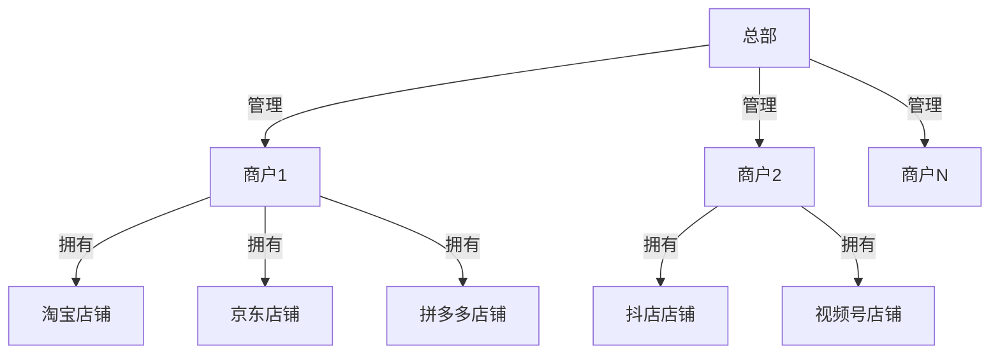
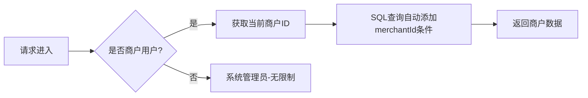
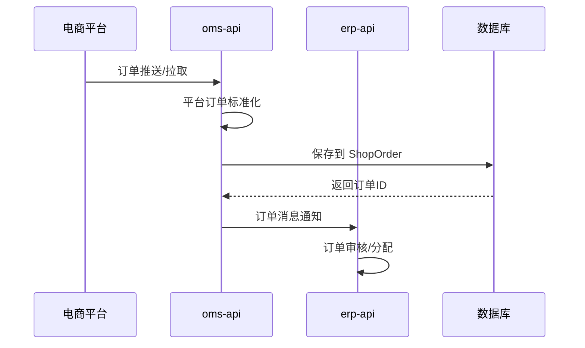

# AGENTS.md - 智能编码指南

## 🎉 4.0版本升级说明

> **开源版正在全面升级到4.0版，功能架构与启航电商ERP商业版对齐！**

### 4.0核心升级要点

| 升级方向 | 说明 |
|---------|------|
| **统一数据模型** | 所有平台店铺数据采用统一的表保存（`ShopOrder`、`ShopOrderItem`等） |
| **多商户架构** | 支持总部-商户-店铺三级销售架构体系 |
| **serviceImpl对齐** | 服务实现层与商业版接口保持一致 |
| **model层重构** | 实体模型全面升级，支持多租户隔离 |

### 统一数据表设计（核心变化）

4.0版本最重大的架构变更：**所有平台店铺数据采用统一表保存**

**旧架构（按平台分表）：**
```
oms_tao_order      -- 淘宝订单
oms_jd_order       -- 京东订单  
oms_pdd_order      -- 拼多多订单
oms_dou_order      -- 抖店订单
...
```

**新架构（统一表）：**
```
oms_shop_order     -- 所有平台店铺订单统一表
oms_shop_order_item -- 所有平台店铺订单子项统一表
oms_shop_refund    -- 所有平台店铺售后统一表
```

**统一表设计优势：**
1. **简化开发**：一套代码处理所有平台订单
2. **统一查询**：跨平台订单聚合查询更高效
3. **易于扩展**：新增平台无需新增表结构
4. **数据一致性**：统一的数据模型和处理逻辑

### 三层销售架构体系



**层级说明：**
| 层级 | 说明 | 职责 |
|------|------|------|
| **总部** | 系统管理员 | 管理所有商户、配置全局参数 |
| **商户** | 租户/商家 | 独立管理店铺、商品、订单 |
| **店铺** | 平台店铺 | 对接淘宝、京东、拼多多等平台 |

### Model层设计

**统一实体设计：**

| 实体 | 表名 | 说明 |
|------|------|------|
| `ShopOrder` | `oms_shop_order` | 统一店铺订单表 |
| `ShopOrderItem` | `oms_shop_order_item` | 统一订单子项表 |
| `ShopRefund` | `oms_shop_refund` | 统一售后表 |
| `ShopGoods` | `oms_shop_goods` | 统一店铺商品表 |
| `ShopGoodsSku` | `oms_shop_goods_sku` | 统一店铺商品SKU表 |
| `ErpMerchant` | `o_merchant` | 商户表（租户信息） |
| `OShop` | `o_shop` | 店铺表（平台店铺配置） |

**核心字段说明：**

| 字段 | 类型 | 说明 |
|------|------|------|
| `merchantId` | Long | 商户ID（租户隔离） |
| `shopId` | Long | 店铺ID |
| `shopType` | Integer | 店铺类型（淘宝/京东/拼多多等） |
| `orderId` | String | 平台订单号 |

### 多租户隔离机制

**4.0版本实现商户级数据隔离：**



**隔离策略：**
1. **数据库层**: 所有业务表包含 `merchantId` 字段
2. **Service层**: 查询时自动注入商户ID过滤条件
3. **Controller层**: 通过上下文获取当前商户

### AI原生ERP设计

**4.0版本通过OpenApi+CLI构建供AI调用的系统：**

| 模块 | 说明 |
|------|------|
| `open-api` | AI可调用的开放API接口（供AI/外部系统调用） |
| `CLI工具` | AI使用的命令行范例 |

**AI能力应用：**
- AI通过标准OpenApi调用实现业务自动化
- CLI工具作为AI使用的参考实现
- 开放接口供AI大模型集成调用
- 实现智能化订单、库存、报表等业务处理

### 统一订单处理流程



### 平台类型枚举

| 枚举值 | 平台 | 索引值 |
|--------|------|--------|
| `TAO` | 淘宝/天猫 | 1 |
| `JD` | 京东 | 2 |
| `PDD` | 拼多多 | 3 |
| `DOU` | 抖店 | 4 |
| `WEI` | 微信小店 | 5 |
| `KWAI` | 快手 | 6 |
| `XHS` | 小红书 | 7 |
| `OFFLINE` | 线下订单 | 100 |
| `ERP_ORDER` | ERP订单 | 101 |

---

## 项目概述

启航电商ERP系统 (qihang-ecom-erp-open) 技术栈：
- **前端**: Vue 2 + ElementUI + Vuex + Vue Router
- **后端**: SpringCloud 微服务 (Java 17) + Maven
- **数据库**: MySQL 8 + Redis 7

---

## 构建与测试命令

### 前端 (Vue)

```bash
cd vue
npm install
npm run dev              # 开发服务器 (端口 88)
npm run build:prod      # 生产构建
npm run build:stage      # 测试环境构建
npm run preview          # 预览构建结果
npm run lint             # 代码检查
npm run lint -- --fix    # 自动修复
npx eslint --ext .js,.vue src/views/example.vue  # 检查单个文件
```

### 后端 (Java/Maven)

```bash
mvn clean install                  # 构建所有模块
mvn clean package -DskipTests     # 构建跳过测试
mvn -pl <module-name> clean install  # 构建指定模块
java -jar target/*.jar            # 运行 SpringBoot 应用
```

---

## 代码风格指南

### 基本原则

1. **添加注释** - 除非用户明确要求，否则要添加注释
2. **中文注释** - 如需注释，使用中文
3. **保持一致** - 遵循现有代码模式

---

### Vue/JavaScript 规范

#### 命名规范
- **组件**: PascalCase (`UserProfile.vue`)
- **文件/变量**: camelCase (`userName`, `orderList`)
- **常量**: UPPER_SNAKE_CASE
- **布尔变量**: 使用 `is`、`has`、`can` 前缀

#### 导入顺序
1. Vue/Vue Router/VueX
2. 第三方库 (axios, element-ui)
3. @ 别名导入 (@/utils, @/api)
4. 相对路径 (./, ../)

```javascript
// 正确示例
import Vue from 'vue'
import axios from 'axios'
import { getToken } from '@/utils/auth'
import Cookies from 'js-cookie'
```

#### ESLint 格式化
- 缩进: 2 空格
- 引号: 单引号
- 分号: 不使用
- 大括号: 1TBS 风格

#### 模板规范
- 组件名 PascalCase 或 kebab-case
- v-for 必须带 :key

```vue
<template>
  <el-input v-model="form.username" />
  <UserProfile :user-id="userId" />
</template>
```

#### 组件结构
```vue
<template>
  <!-- 模板内容 -->
</template>

<script>
export default {
  name: 'ComponentName',
  components: {},
  props: {},
  data() { return {} },
  computed: {},
  watch: {},
  created() {},
  methods: {}
}
</script>

<style lang="scss">
/* 样式内容 */
</style>
```

---

### Java 规范

#### 包结构
```
cn.qihangerp
├── api/              # Controller
├── serviceImpl/      # Service接口与实现统一层（包含Mapper、业务接口及实现）
├── model/            # Entity, DTO, VO, BO
│   ├── entity/       # 数据库实体
│   ├── dto/          # 数据传输对象
│   ├── vo/           # 视图对象
│   ├── bo/           # 业务对象
│   └── query/        # 查询条件
└── common/           # 通用工具
```

#### 命名规范
- **类**: PascalCase
- **接口**: 以 I 开头 (IUserService)
- **方法**: camelCase

#### Spring 规范
- Service: `I{Entity}Service` / `{Entity}ServiceImpl`
- Controller: `{Entity}Controller`
- 使用 @Autowired 注入
- 使用 MyBatis-Plus `IService<T>`

#### 代码风格
- 使用 Lombok @Data, @Slf4j
- 使用 fastjson2 处理 JSON
- 返回 `ResultVo<T>`
- 使用 `PageQuery` / `PageResult<T>` 分页

```java
public interface OOrderService extends IService<OOrder> {
    PageResult<OOrder> queryPageList(OrderSearchRequest bo, PageQuery pageQuery);
    ResultVo<Integer> manualShipmentOrder(OrderShipRequest shipBo, String createBy);
}
```

---

### 错误处理

**前端**: 使用 ElementUI `this.$message()` 反馈
```javascript
this.$message({ message: '操作失败', type: 'error' })
```

**后端**: 返回 `ResultVo` 错误码，使用 `@ExceptionHandler`
```java
@ExceptionHandler(Exception.class)
public ResultVo<String> handleException(Exception e) {
    return ResultVo.error(e.getMessage());
}
```

---

### Git 工作流

1. 从 main 创建功能分支
2. 提交格式: `feat: add feature` / `fix: resolve issue`
3. 提交前运行 `npm run lint`

---

## 项目目录结构

### 前端 (vue/src/)
```
vue/src/
├── api/           # API 接口定义
├── assets/        # 静态资源
├── components/    # 公共组件
├── layout/        # 布局组件
├── plugins/       # Vue 插件
├── router/        # 路由配置
├── store/         # Vuex 状态管理
├── utils/         # 工具函数
└── views/         # 页面组件
```

### 后端模块

```
api/              # 微服务接口层
├── gateway/      # 网关 (8088)
├── sys-api/      # 系统管理 (8082)
├── erp-api/      # ERP主功能 (8083)
├── oms-api/      # 订单消息 (8081)
└── open-api/     # 开放API (8090) - 供AI/外部系统调用
core/             # 公共库
├── common/       # 通用工具
└── security/     # 权限认证
model/            # 领域模型 (entity, bo, vo, dto, query)
serviceImpl/      # Service接口与实现统一层（包含Mapper、业务接口及实现）
```

---

## 开发技巧

### 路径别名
使用 `@` 代替相对路径
```javascript
// 推荐
import foo from '@/utils/foo'
// 避免
import foo from '../../../utils/foo'
```

### API 请求
通过 `utils/request.js`，自动处理 token 和 401

### 环境变量
在 vue/ 下创建 `.env.development`
```
VUE_APP_BASE_API=/prod-api
NODE_OPTIONS=--openssl-legacy-provider
```

---

## 技术栈版本

- Node.js >= 20.0.0 | Java 17 | Maven 3.9
- Vue 2.6.12 | ElementUI 2.15.13
- Spring Boot 3.0.2 | Spring Cloud 2022.0.0

---

## 平台命名规范

| 平台 | 前缀 | 示例 |
|------|------|------|
| 淘宝/天猫 | Tao | TaoOrderService |
| 京东 | Jd | JdGoodsService |
| 拼多多 | Pdd | PddOrderService |
| 抖音/抖店 | Dou | DouRefundService |
| 微信小店 | Wei | WeiOrderService |
| 线下/私域 | Offline | OfflineOrderService |

---

## 关键文件

| 文件 | 用途 |
|------|------|
| `vue/src/utils/request.js` | Axios 拦截器 |
| `vue/src/utils/auth.js` | Token 管理 |
| `vue/src/api/` | API 端点定义 |
| `vue/src/store/` | Vuex 模块 |
| `vue/.eslintrc.js` | ESLint 配置 |
| `vue/vue.config.js` | Vue CLI 配置 |
| `pom.xml` | Maven 父 POM |

---

## 数据库规范

- 表名: `o_` 订单, `g_` 商品, `s_` 库存
- 使用 MyBatis-Plus 注解
- Entity 类位于 `model/src/main/java/cn/qihangerp/model/entity/`
- 使用 `PageQuery` 分页查询
- 时间戳: `createTime`, `updateTime`

---

## API 响应格式

### 后端
```java
// 成功
ResultVo.success(data);
ResultVo.success();

// 失败
ResultVo.error("错误信息");
ResultVo.error(500, "错误信息");
```

### 前端
```javascript
// 统一通过 utils/request.js 处理
// 成功返回 res.data，失败抛出异常
```
