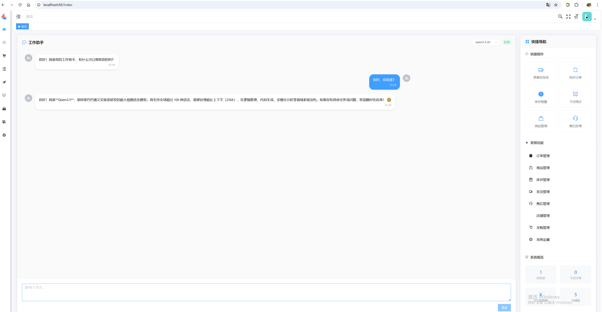
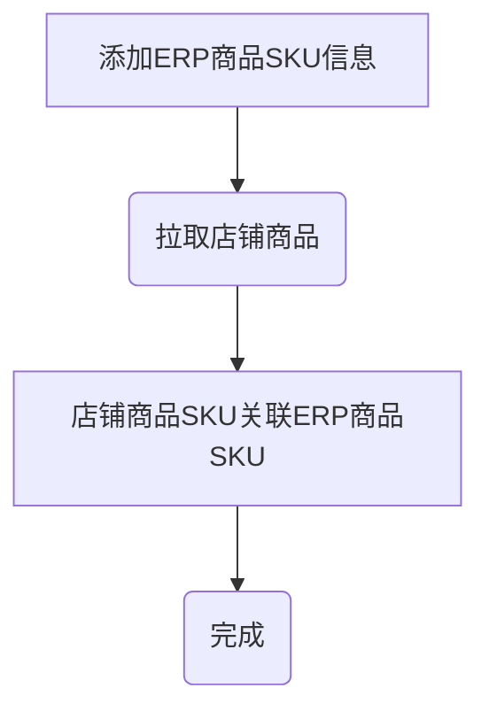
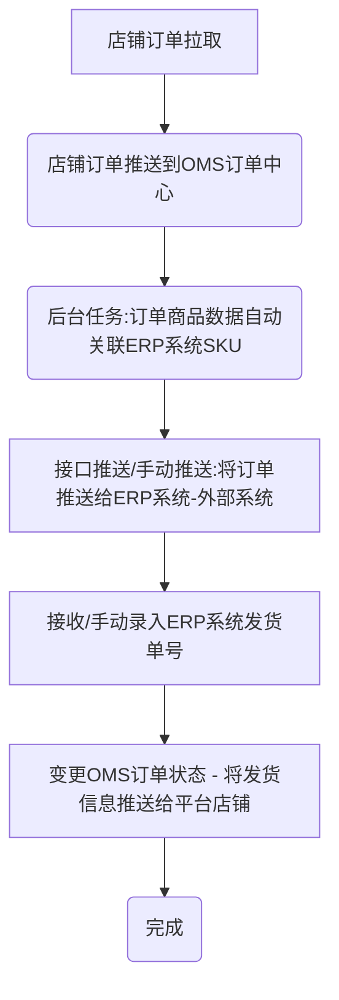
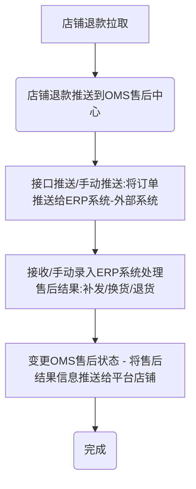
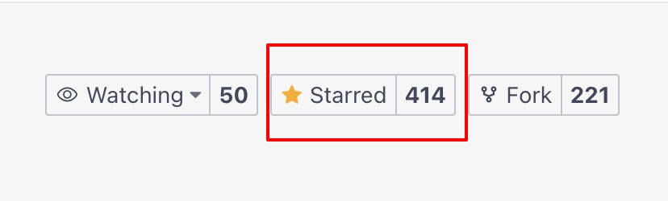

# 启航电商ERP系统-微服务版

> **欢迎来到我们的开源项目！创新、协作、高质量的代码。您的Star🌟，是我们前进的动力！ 💪✨🏆**

> **项目持续更新中，还有很多不足，请多包含！如有任何疑问请提交issuse！谢谢！ 💪✨🏆**

## 一、系统介绍
启航电商ERP系统2.0版本是一个完整开箱即用的开源电商ERP系统，经历1.0版本的迭代优化和客户使用验证。开发者可以直接部署即可使用。

启航电商ERP系统是一个专注核心订单处理业务，主体功能包括：商品库管理（商品、SKU、分类、属性、供应商等）、订单库管理、店铺订单管理、发货管理（支持多供应商发货）、电子面单打印、售后管理、库存管理、店铺管理（店铺管理、店铺商品管理、店铺电子面单账号管理、平台参数设置）等。

与此同时该系统会陆续增加供外部调用的API，以便开发者满足自己的个性化业务需求。

启航电商ERP系统支持：淘宝天猫、京东、拼多多、抖店、微信小店等平台，后续将继续对接其他电商平台。



#### 系统特点
+ 1、启航电商ERP系统是一个专注核心订单业务处理并且又能快速方便扩展个性化需求的一个底座。

+ 2、该系统适合想自研电商系统的企业快速构建业务。**系统并不适合小卖家，小卖家还是老老实实使用市面上流行的SAAS吧。**

+ 3、使用启航电商ERP系统的前置条件是：**自行申请各电商开放平台的AppKey** [开放平台申请说明](https://mp.weixin.qq.com/s/KqyNlIVl43dTWicaAeLR1g)


#### 主体功能

启航电商ERP系统支持多平台多店铺订单、售后、商品等管理，目前已接入：淘宝、京东、拼多多、抖店、微信小店，后续会继续接入快手小店、小红书等。

主体功能包括：
+ 商品库管理：商品库管理、分类&分类属性管理、供应商管理等。
+ 订单管理：店铺订单同步、管理。
+ 发货管理：电子面单打印、发货记录、物流跟踪等。
+ 售后管理：店铺售后同步、售后处理（补发、换货、退货处理）等。
+ 店铺&平台参数设置：店铺管理、店铺商品管理（拉取店铺商品、ERP关联）、店铺电子面单账户管理、平台参数设置。

**基本上覆盖了电商订单业务处理全流程，可使用接口对接内部ERP系统。**

**订单打单（电子面单打印）已支持：抖店、微信小店**

#### 系统架构

本项目后端采用`SpringCloudAlibaba`微服务架构开发。

前端采用`Vue2`+`ElementUI`开发

+ 后端技术及组件
  + Nacos 注册中心
  + Redis

## 二、关键流程

### 2.1 关联商品SKU



### 2.2 处理订单（发货）



### 2.3 处理售后




## 三、功能模块
#### 1、商品管理
+ 商品库管理：管理商品库商品，提供手动录入、API接收功能，可以设置自己发货还是供应商发货（影响到后台分单逻辑，即时生效）。
+ 商品库SKU明细：查看所有商品库SKU
+ 商品分类管理
+ 商品品牌管理
+ 供应商管理

#### 2、订单管理
+ 订单库：聚合订单查询、详情、管理。
+ 订单明细：聚合订单明细查询。
+ 店铺订单管理：订单API拉取、订单API更新、订单手动推送等，支持淘宝天猫、京东、拼多多、抖店、微信视频号。


#### 3、发货管理
+ 待发货清单：（商品维度、订单维度），展示待分配发货的清单（系统会根据商品设置的自己发货还是供应商发货自动分配到发货订单库）
+ 取号发货：电子面单取号发货
+ 订单打印：电子面单打印，支持淘宝天猫、京东、拼多多、抖店、微信视频号。
+ 备货出库：电子面单取号之后会加入备货清单，提供给仓库备货查询。发货之后会从备货清单中移除。
+ 发货记录：发货记录，提供手动发货功能。
+ 物流跟踪：提供发货物流查询。
+ 快递快递管理：管理发货的快递公司（支持从平台拉取、支持线下渠道手动添加发货快递）。
+ 面单账户管理：管理店铺开通的电子面单账户

#### 4、售后管理
+ 售后中新：聚合售后查询、详情、管理。
+ 店铺售后管理：售后API拉取、售后API更新、手动推送、售后操作（同意、备注）。
+ 售后处理记录：售后处理的记录查询，提供手动售后处理功能。


#### 5、库存管理
+ 商品库存管理：查询库存
+ 商品入库管理：支持手动入库
+ 商品出库管理：支持手动出库
+ 仓库仓位设置

#### 6、店铺&平台设置
+ 店铺管理
+ 店铺商品管理：店铺商品管理，店铺商品API拉取、店铺商品API更新（进行店铺商品与商品库商品关联，根据SKU编码关联）。
+ 平台设置
+ 订单更新日志：查询更新日志，主动排错。
+ 售后更新日志：查询更新日志，主动排错。
+ 定时任务配置


## 四、项目架构
### 1、开发环境级组件
#### 1.1 开发环境
+ Jdk：17
+ Nodejs：v16.20.0

#### 1.2、存储及中间件

+ MySQL8
+ Redis：7.x
+ Nacos：2.3.1（注册中心）
+ Sentinel（分布式流量治理组件）


### 2、项目结构
#### 2.1 `core`公共类库
+`common`
项目公共模块

+ `security`
公共权限验证模块
#### 2.2 `module`
+ `goods`:商品模块
+ `open`:开放平台模块
+ `order`:订单模块
+ `shop`:店铺模块
+ `stock`:库存模块
+ `sys`:系统模块

#### 2.3 `api`微服务
+ `gateway`
网关项目，负责微服务接口转发，前端统一通过网关调用其他微服务接口；

采用`gateway`进行api分发，引入Sentinel进行流量治理。

+ `sys-api`
项目系统微服务，主要功能包括：

+ 用户
+ 菜单

+ `oms-api`
oms主功能微服务，主要功能包括：

+ 队列消息处理（订单消息、退款消息）
+ 订单接口
+ 退款接口
+ 店铺接口

+ `open-api`
各开放平台微服务

+ 淘宝开放平台接口api


+ 京东开放平台接口api


+ 抖店开放平台接口api


+ 拼多多开放平台接口api


+ 微信小店开放平台接口api


+ 快手小店开放平台接口api


### 3、运行说明
#### 3.1、启动环境

1. 启动MySQL8

2. 启动Redis7

3. 启动Sentinel1.8.7控制台(可以不需要)
   `java -Dserver.port=8888 -Dcsp.sentinel.dashboard.server=localhost:8888 -Dproject.name=sentinel-dashboard -jar sentinel-dashboard.jar`
4. 启动Nacos（注册中心）


#### 3.2、导入数据库
+ 创建数据库`qihang-oms`
  + 导入数据库结构：sql脚本`docs\qihang-oms.sql`


#### 3.3、启动服务(项目)
1.  启动开放平台微服务（`open-api`）
2.  启动`sys-api`、`oms-api`微服务
3.  启动微服务网关（`gateway`）

#### 3.4、运行前端
+ Nodejs版本：v16.20.0
+ 进入`vue`文件夹
+ 运行`npm install` 
+ 运行`npm run dev`
+ 浏览网页`http://localhost:88`
+ 登录账号：`admin`
+ 登录密码：`admin123`

### 4、项目部署

#### 4.1 打包

##### 后端打包
`mvn clean package`

##### 前端打包
`pnpm run build:prod`


#### 4.2 Nginx配置
```
# 上传文件至远程服务器
将打包生成在 `dist` 目录下的文件拷贝至 `/usr/share/nginx/html` 目录

# nginx.cofig 配置（主要是配置接口转发）
server {
	listen     88;
	server_name  localhost;
	location / {
			root /usr/share/nginx/html;
			index index.html index.htm;
	}
	# 反向代理配置
	location /prod-api/ {
			proxy_pass http://127.0.0.1:8088/; # 替换成你的后端网关API地址
	}
}
```


## 五、支持一下

**感谢大家的关注与支持！希望利用本人从事电商10余年的经验帮助到大家提升工作效率！**

### 5.1 赠人玫瑰手留余香
💖 如果觉得有用记得点个 Star⭐



### 5.2 一起交流

💖 欢迎加入知识星期获得作者帮助和朋友们一起交流！

+ 微信公众号


### 5.3 捐助作者
作者为兼职做开源,平时还需要工作,如果帮到了您可以请作者吃个盒饭


### 5.4 获取授权与服务

[如何获取授权与服务](https://mp.weixin.qq.com/s/mATn2nfc5bUePohS_s2WGw)


