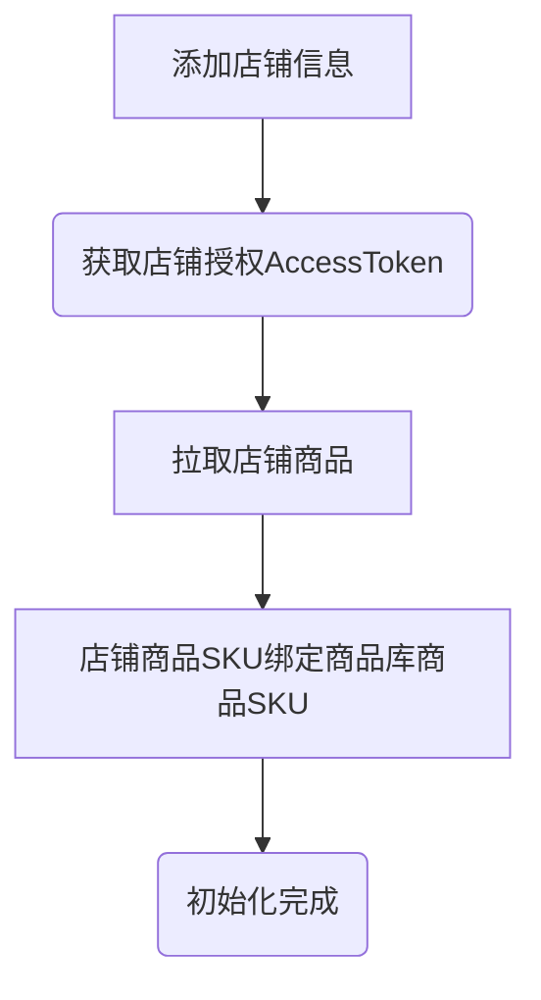
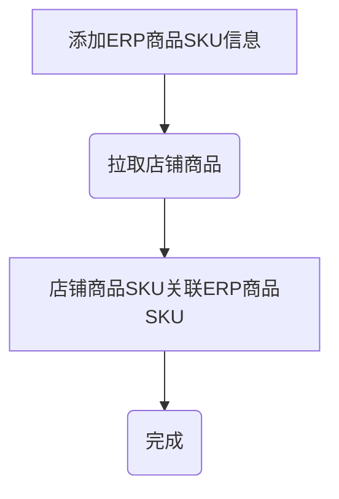
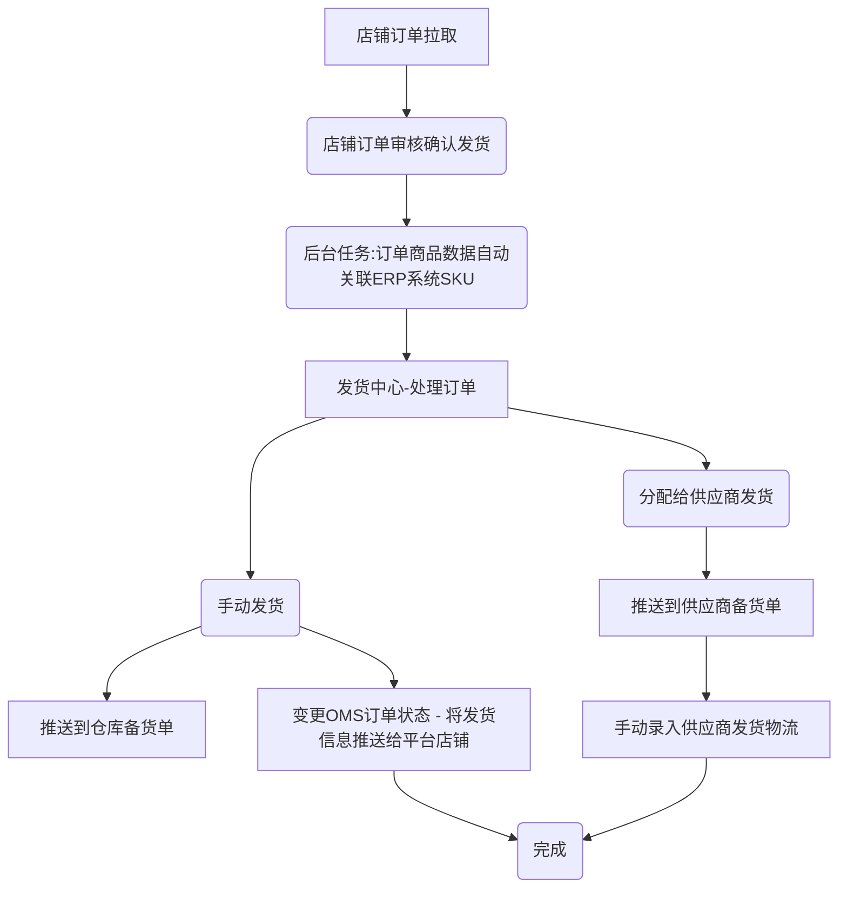
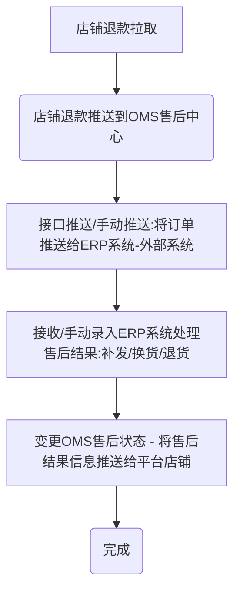

# 启航电商ERP系统-电商企业数字化底座

> **欢迎来到我们的开源项目！创新、协作、高质量的代码。您的Star🌟，是我们前进的动力！ 💪✨🏆**

> **项目持续更新中，还有很多不足，请多包含！如有任何疑问请提交issuse！谢谢！ 💪✨🏆**

> **启航电商ERP系统正在重构AI原生ERP系统。**


## 🎉 4.0版本重大升级（与商业版功能架构对齐）

> **🔥 开源版正在全面升级到4.0版，功能架构与启航电商ERP商业版对齐！**
>
> **📖 商业版最新功能文档：[https://gitee.com/qiliping/qihangerp-docs](https://gitee.com/qiliping/qihangerp-docs)**

### 4.0核心特性

| 特性 | 描述 | 状态 |
|------|------|------|
| **多商户架构** | 商户独立管理店铺、商品、采购、订单、出入库 | 开发中 |
| **多仓库支持** | 本地仓、系统云仓、京东云仓 | 开发中 |
| **多供应商支持** | 供应商发货处理、备货单管理 | 开发中 |
| **AI原生ERP** | 通过OpenApi+CLI构建供AI调用的系统 | 开发中 |
| **完整进销存** | 采购、销售、出入库全流程管理 | 开发中 |
| **三级销售架构** | 总部-商户-店铺三级体系 | 开发中 |

---

**升级预告（2026-04-28）：开源版本即将实现商业版中的总部-商户-店铺三级销售架构体系，敬请期待！**


## 一、系统介绍

**启航电商ERP系统正在重构AI原生ERP系统。**

#### 项目定位

**启航电商ERP系统是一个驱动电商企业数智化转型的电商业务中台底座。**

该项目采用SpringCloud微服务开发，通过OpenApi+CLI构建供AI调用的系统，实现AI原生电商ERP系统。AI场景包括：

+ 完整的供AI大模型调用的开放接口（持续完善中）；
+ CLI命令行工具（AI使用范例）；
+ 接入大模型数据分析（持续更新中）；


系统支持多平台多店铺管理，拥有商品、订单、售后、库存、电子面单等电商核心业务处理能力，支持：淘宝、京东、拼多多、抖店、微信小店、快手、小红书等。

主体功能包括：采购管理、商品管理、订单管理、售后管理、发货管理、仓库管理等。

**系统拥有完善的对外开放接口，可以很方便地与企业原有其他ERP、WMS、财务等系统进行对接。**

**商业版支持多商户、多供应商、多仓库独立子系统处理业务，还对接了京东云仓可以直接将订单推送到京东云仓发货**

**该系统可作为电商企业数字化转型的订单中台系统底座使用，教程及文档请阅读开源文档或者访问官网：qihangerp.cn**

---

##### 💡 申请不到平台 API (AppKey) 怎么办？

**启航电商 ERP** 专为大中型电商设计，依赖官方 API 实现自动化。如果您面临以下情况：
* ❌ 无法申请淘宝、抖音、拼多多等平台的官方 API 权限
* ❌ 需要快速部署生产环境，不想折腾开源版
* ❌ 需要专业的技术支持和售后服务

**欢迎升级到启航电商ERP商业版：**

👉 **[启航电商ERP商业版](https://gitee.com/qiliping/qihangerp-docs)**

* **API无忧**：提供平台API协助申请，或者采用第三方API接口服务（商业版内置了第三方API）
* **一键部署**：专业运维团队协助上线
* **专属支持**：7x24小时技术支持服务
* **更多功能**：多商户架构、多仓库支持、第三方API支持、三方云仓（如：京东云仓）支持、AI智能分析

---

**如果您只需要订单处理功能，不需要完整ERP：**

👉 **[启航电商OMS订单中台](https://gitee.com/qiliping/qihang-oms)**

* **多平台聚合**：支持淘宝、京东、拼多多、抖店、微信等平台订单统一管理
* **灵活处理**：支持API自动拉单 + 手动导入订单双模式
* **轻量部署**：单体架构，30分钟部署完成，开源可定制
* **数据自有**：完全本地部署，数据100%自主掌控

---

**如果您只是需要简单的进销存记账工具：**

👉 **[启航电商库存账簿](https://gitee.com/qiliping/qihang-stock-books)**

* **免 API 依赖**：直接导入平台导出的 Excel 报表即可实现财务级对账。
* **极速开单**：内置 CLI 工具，支持扫码枪与全键盘高频操作。
* **低成本部署**：架构更轻，对服务器配置要求更低。

---

### 💡 自研 vs 购买：算一笔账

有能力部署开源版的团队，通常会纠结一个问题：**用开源版自己维护，还是直接买商业版？**

| 成本项 | 自研（基于开源版二次开发） | 购买商业版 |
|:------|:------------------------|:----------|
| 技术团队 | 至少 1-2 人维护（年薪 30-50 万） | 无需组建 |
| 开发周期 | 3-6 个月熟悉代码和二次开发 | 即买即用 |
| 平台对接 | 逐个申请 AppKey、调试接口 | 已对接所有主流平台 |
| 持续迭代 | 自己跟进平台 API 变更 | 商业版负责更新 |
| 多商户/多仓库 | 需自行开发 | 商业版内置 |
| 风险 | 人员离职、代码质量问题 | 厂商保障 |
| **年成本** | **30-50 万+** | 源码买断，永久授权，无需年费|

> **结论：** 如果你的团队有技术能力且有空闲人力，开源版是不错的底层框架；如果你需要快速上线、降低风险，**商业版是更经济的选择**。

---
## 二、核心流程与功能


### 关键流程
#### 平台初始化流程

```mermaid
graph TD
    A[添加店铺信息] -->B(获取店铺授权AccessToken)
    B --> C[拉取店铺商品]
    C --> D[店铺商品SKU绑定商品库商品SKU]
    D --> E(初始化完成)
```

#### 绑定商品库商品SKU

```mermaid
graph TD
    A[添加ERP商品SKU信息] -->B(拉取店铺商品)
    B --> C[店铺商品SKU关联ERP商品SKU]
    C --> E(完成)
```


#### 处理订单（发货）

```mermaid
graph TD
    A[店铺订单拉取] -->B(店铺订单审核确认发货)
    B --> C(后台任务:订单商品数据自动关联ERP系统SKU)
    C --> D[发货中心-处理订单]
    D --> E1(分配给供应商发货)
    D --> E2(手动发货)
    E1 --> F1[推送到供应商备货单]
    E2 --> F2[推送到仓库备货单]
    F1 --> G1[手动录入供应商发货物流]
    E2 --> G[变更OMS订单状态 - 将发货信息推送给平台店铺]
    G --> H(完成)
    G1 --> H
   
```


#### 处理售后


```mermaid
graph TD
    A[店铺退款拉取] -->B(店铺退款推送到OMS售后中心)
    B --> D[接口推送/手动推送:将订单推送给ERP系统-外部系统]
    D --> E[接收/手动录入ERP系统处理售后结果:补发/换货/退货]
    E --> F[变更OMS售后状态 - 将售后结果信息推送给平台店铺]
    F --> G(完成)
```


### 主体功能

启航电商ERP系统支持多平台多店铺订单、售后、商品等管理，目前已接入：淘宝、京东、拼多多、抖店、微信小店，后续会继续接入快手小店、小红书等。

启航电商ERP系统逐步演变成了一个完整的ERP，主体功能包括：

+ 采购管理：采购单管理、采购单入库、供应商管理等；

+ 商品管理：
  + 商品库管理：商品、分类&分类属性管理等。
  + 店铺商品管理：店铺商品同步、关联ERP商品等。

+ 订单管理
  + 订单库：所有平台所有店铺订单聚合；
  + 店铺订单管理：店铺订单同步、管理。

+ 发货管理：
  + 电子面单打印发货
  + 手工发货管理
  + 供应商发货管理
  + 发货记录、物流跟踪等
  + 店铺电子面单账户管理
  + 发货设置

+ 售后管理：店铺售后同步、售后处理（补发、换货、退货处理）等。

+ 店铺&平台参数设置：店铺管理、店铺商品管理、平台参数设置。


#### 系统架构

本项目后端采用`SpringCloudAlibaba`微服务架构开发。

前端采用`Vue2`+`ElementUI`开发

+ 后端技术及组件
  + Nacos 注册中心
  + Redis


## 三、功能模块

#### 1、商品库
+ 商品库：管理商品库商品，提供手动录入、API接收功能，可以设置自己发货还是供应商发货（影响到后台分单逻辑，即时生效）。
+ 店铺商品：店铺商品管理，店铺商品API拉取、店铺商品API更新（进行店铺商品与商品库商品关联，根据SKU编码关联）。
+ 商品分类管理
+ 商品品牌管理

#### 2、采购管理

+ 采购单：采购单创建、审核等管理。
+ 采购入库：采购物流、收货、生成入库单。
+ 采购承运商：承运商管理。
+ 供应商管理：管理供应商。


#### 3、订单管理
+ 发货订单库：审核发货的店铺订单。
+ 店铺订单管理：订单API拉取、订单API更新、审核发货等，支持淘宝天猫、京东、拼多多、抖店、微信小店。
+ 订单拉取日志：记录店铺订单每次拉取日志。，


#### 4、发货管理
+ 发货&分配发货：
  + 待发货：展示待发货和待分配发货的订单
  + 已发货：已经处理并发货的订单；
  + 已分配供应商发货：已经分配给供应商发货的订单；
+ 电子面单发货：支持快递打印、发货、补单等功能，开源版暂时不支持。
+ 备货单：已发货、已分配给供应商发货、电子面单打印快递单完成都会加入备货清单，提供给仓库备货查询。备货单可以生成出库单。
+ 发货记录：发货记录，提供手动发货功能。
+ 发货设置：设置发货快递、电子面单账户等信息
  + 快递公司管理：管理发货的快递公司（支持从平台拉取、支持手动添加）。
  + 电子面单账户设置：管理店铺开通的电子面单账户


#### 5、售后管理
+ 售后中心：聚合售后查询、详情、管理。
+ 店铺售后管理：售后API拉取、售后API更新、手动推送、售后操作（同意、备注）。
+ 售后处理记录：售后处理的记录查询，提供手动售后处理功能。
+ 售后拉取日志：店铺售后单拉取日志；


#### 6、库存管理
+ 商品库存管理：查询库存
+ 商品入库管理：支持手动入库
+ 商品出库管理：支持手动出库
+ 仓库仓位设置


#### 7、店铺&平台设置
+ 店铺管理
+ 平台开关

## 四、项目架构
### 1、开发环境级组件
#### 1.1 开发环境
+ Java：17
+ Nodejs：v20.20.0
+ Maven：3.9

#### 1.2、存储及中间件

+ MySQL8
+ Redis：7.x
+ Nacos：2.3.2（注册中心）
+ Sentinel（分布式流量治理组件）


### 2、项目结构
#### 2.1 `core`公共类库
+ `common`: 通用工具类、结果封装、工具函数等
+ `security`: 权限认证、JWT安全模块

#### 2.2 `model`领域模型层
+ `entity`: 数据库实体类（OGoods、OOrder、OShop等）
+ `bo`: 业务对象（TaoOrderBo、JdOrderBo等）
+ `vo`: 视图对象（UserInfoVo、MenusVo等）
+ `dto`: 数据传输对象

#### 2.3 `serviceImpl`业务层
+ Service接口与实现统一层，包含Mapper、业务接口及实现
+ 包含商品、订单、店铺、售后等各模块的数据访问和业务逻辑

#### 2.4 `api`微服务
+ `gateway`

  网关项目，负责微服务接口转发，前端统一通过网关调用其他微服务接口；

  采用`gateway`进行api分发，引入Sentinel进行流量治理。

+ `sys-api`

  项目系统微服务，主要功能包括：

  + 用户
  + 系统菜单
  + 字典
    等等...

+ `erp-api`

  erp主功能微服务，主要功能包括：
  + 商品库
  + 采购模块
  + 库存模块
  + 队列消息处理（订单消息、退款消息）
  + 订单接口
  + 退款接口
  + 店铺接口

+ `open-api`

  **开放API接口（供AI/外部系统调用）**

  本系统对外开放的API接口，外部系统（包括AI）可以使用appkey+appsecret进行鉴权访问，是供AI调用的主要入口。

  + 鉴权方式：使用appKey + appSecret + 签名进行身份验证
  + 主要接口：商品接口、订单接口、店铺接口、仓库接口等


### 3、运行说明
#### 3.1、启动环境

1. 启动MySQL8

2. 启动Redis7

3. 启动Sentinel1.8.7控制台(可以不需要)
   `java -Dserver.port=8888 -Dcsp.sentinel.dashboard.server=localhost:8888 -Dproject.name=sentinel-dashboard -jar sentinel-dashboard.jar`
4. 启动Nacos（注册中心）


#### 3.2、导入数据库
+ 创建数据库`qihang-erp`
+ 导入数据库结构：sql脚本`docs\qihang-erp.sql`


#### 3.3、启动服务(项目)
1.  启动开放平台微服务（`oms-api`）
2.  启动`sys-api`、`erp-api`微服务
3.  启动微服务网关（`gateway`）

#### 3.4、运行前端
+ Nodejs版本：v20.20.0
+ 进入`vue`文件夹
+ 运行`npm install`
+ 运行`npm run dev`
+ 浏览网页`http://localhost:88`
+ 登录账号：`admin`
+ 登录密码：`admin123`

### 4、项目部署

#### 4.1 打包

##### 后端打包
+ 1、install

  `mvn clean install`
+ 2、package

  `mvn clean package`

##### 前端打包
`npm run build:prod`

#### 4.2 部署
##### 后端部署

+ jar部署

+ docker部署

##### 前端部署
+ Nginx配置
```
# 处理 /prod-api/ 的代理请求
location /prod-api/ {
    proxy_set_header Host $http_host;
    proxy_set_header X-Real-IP $remote_addr;
    proxy_set_header REMOTE-HOST $remote_addr;
    proxy_set_header X-Forwarded-For $proxy_add_x_forwarded_for;
    # --- 新增 SSE 关键配置 ---
    proxy_http_version 1.1;       # 必须使用 HTTP/1.1
    proxy_buffering off;          # 关闭缓冲，确保数据实时发送
    proxy_read_timeout 1800s;     # 增加读取超时时间 (例如 30 分钟)
    proxy_send_timeout 1800s;     # 增加发送超时时间 (例如 30 分钟)
    proxy_connect_timeout 60s;    # 连接超时时间
    # --- 结束新增 ---

    proxy_pass http://127.0.0.1:8088/;
}
```
+ docker运行

---

## 📦 启航电商开源生态

启航电商旗下开源项目矩阵，所有项目共同指向统一商业版：

| 项目 | 定位 | Gitee | GitHub |
|:----|:----|:-----|:-------|
| **启航电商ERP ⬅** | **电商业务中台底座（微服务）** | [Gitee](https://gitee.com/qiliping/qihang-ecom-erp-open) | [GitHub](https://github.com/zeasin/qihang-ecom-erp-open) |
| [OMS 订单中台](https://gitee.com/qiliping/qihang-oms) | 轻量级订单管理 | [Gitee](https://gitee.com/qiliping/qihang-oms) | [GitHub](https://github.com/zeasin/qihang-ecom-oms) |
| [库存账簿](https://gitee.com/qiliping/qihang-stock-books) | 极简进销存 | [Gitee](https://gitee.com/qiliping/qihang-stock-books) | [GitHub](https://github.com/zeasin/qihang-stock-books) |
| [跨境ERP](https://gitee.com/qiliping/qihang-cb-erp) | 跨境电商 | [Gitee](https://gitee.com/qiliping/qihang-cb-erp) | [GitHub](https://github.com/zeasin/qihang-cb-erp) |
| [SCM 供应链](https://gitee.com/qiliping/qihangerp-scm) | 多商户多供应商系统（已合并到商业版） | [Gitee](https://gitee.com/qiliping/qihangerp-scm) | [GitHub](https://github.com/zeasin/qihangerp-scm) |

## 💼 商业版

👉 **[启航电商ERP商业版功能预览](https://gitee.com/qiliping/qihangerp-docs)**

👉 **了解更多？→** 电话/微信：15818590119


## 📱 关注我们

|                   公众号：启航电商ERP                   |                   个人号：码农老齐                   |
|:-----------------------------------------------:|:--------------------------------------------:|
|                 产品动态·行业方案·客户案例                  |                技术实战·开源故事·创业心得                |
|  |  |


**感谢关注！我希望将从事电商 10 余年的行业经验沉淀在代码中，帮助大家真正提升经营效率。**

💖 如果项目对您有帮助，请点个 **Star ⭐** 给予鼓励！


---

## ☕ 捐助作者

如果这个项目对您有用，欢迎请作者吃个盒饭，您的支持是项目持续更新的动力！

|                      微信支付                       |                     支付宝                      |
|:-----------------------------------------------:|:--------------------------------------------:|
|                   捐赠随意，捐赠进交流群                   |                捐赠随意，捐赠进交流群                |
|  |  |


