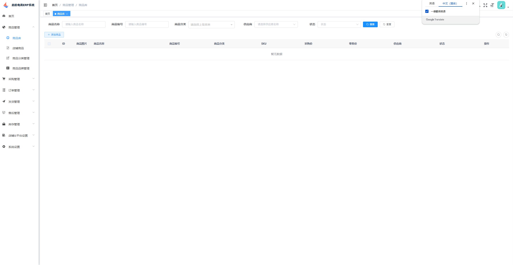

# 启航电商ERP系统

> **欢迎来到我们的开源项目！创新、协作、高质量的代码。您的Star🌟，是我们前进的动力！ 💪✨🏆**

> **项目持续更新中，还有很多不足，请多包含！如有任何疑问请提交issuse！谢谢！ 💪✨🏆**

> **启航电商ERP系统3.0版本在原版本基础上新增自动任务拉取订单、订单自动导入订单库等重大升级，进一步提升了开箱即用的特性。**

## 一、系统介绍

#### 项目定位

启航电商ERP系统是一个驱动电商企业数智化转型的数字底座。

该项目采用SpringCloud微服务开发，帮助企业低成本构建订单中台。

系统支持多平台多店铺商品、订单、售后、库存、电子面单等电商核心业务处理，支持：淘宝、京东、拼多多、抖店、微信小店、快手、小红书等。

主体功能包括：采购管理、商品管理、订单管理、售后管理、发货管理、仓库管理等。

系统拥有完善的对外开放接口，可以很方便地与企业原有其他ERP、WMS、财务等系统进行对接。


#### 主体功能

启航电商ERP系统逐步演变成了一个完整的ERP，主体功能包括：

+ 采购管理
+ 商品管理
+ 店铺商品管理
+ 订单库
+ 店铺订单管理
+ 发货管理（手动发货、电子面单发货、供应商发货）
+ 售后管理
+ 库存管理（仓库管理、支持多仓库）

**商业版支持多商户、多供应商、多仓库独立操作业务，还对接了京东云仓可以直接将订单推送到京东云仓发货**

该系统可作为自行开发电商系统的底座使用，教程及文档请阅读开源文档或者访问官网：qihangerp.cn

启航电商ERP系统支持：淘宝天猫、京东、拼多多、抖店、微信小店等平台，计划很快就会加上快手、小红书。



#### 系统特点

+ 1、启航电商ERP系统开源版是一个专注核心订单业务处理并且又能快速方便扩展个性化需求开发的一个底座。（商业版是一个完整的产品）

+ 2、该系统适合想自研电商系统的企业快速构建企业电商业务。**系统并不适合小卖家，小卖家还是老老实实使用市面上流行的SAAS吧。**

+ 3、使用启航电商ERP系统的前置条件是：**自行申请各电商开放平台的AppKey** [开放平台申请说明](https://mp.weixin.qq.com/s/KqyNlIVl43dTWicaAeLR1g)


#### 主体功能

启航电商ERP系统支持多平台多店铺订单、售后、商品等管理，目前已接入：淘宝、京东、拼多多、抖店、微信小店，后续会继续接入快手小店、小红书等。

主体功能包括：
+ 商品库管理：商品库管理、分类&分类属性管理、供应商管理等。
+ 订单管理：店铺订单同步、管理。
+ 发货管理：电子面单打印、发货记录、物流跟踪等。
+ 售后管理：店铺售后同步、售后处理（补发、换货、退货处理）等。
+ 店铺&平台参数设置：店铺管理、店铺商品管理（拉取店铺商品、ERP关联）、店铺电子面单账户管理、平台参数设置。

**基本上覆盖了电商订单业务处理全流程，可使用接口对接内部ERP系统。**

**订单打单（电子面单打印）已支持：抖店、微信小店**

#### 系统架构

本项目后端采用`SpringCloudAlibaba`微服务架构开发。

前端采用`Vue2`+`ElementUI`开发

+ 后端技术及组件
  + Nacos 注册中心
  + Redis


## 二、关键流程
### 2.0 平台初始化流程


### 2.1 绑定商品库商品SKU


### 2.2 处理订单（发货）


### 2.3 处理售后


## 三、功能模块

#### 1、商品库
+ 商品库：管理商品库商品，提供手动录入、API接收功能，可以设置自己发货还是供应商发货（影响到后台分单逻辑，即时生效）。
+ 店铺商品：店铺商品管理，店铺商品API拉取、店铺商品API更新（进行店铺商品与商品库商品关联，根据SKU编码关联）。
+ 商品分类管理
+ 商品品牌管理

#### 2、采购管理

+ 采购单：采购单创建、审核等管理。
+ 采购入库：采购物流、收货、生成入库单。
+ 采购承运商：承运商管理。
+ 供应商管理：管理供应商。


#### 3、订单管理
+ 发货订单库：审核发货的店铺订单。
+ 店铺订单管理：订单API拉取、订单API更新、审核发货等，支持淘宝天猫、京东、拼多多、抖店、微信小店。
+ 订单拉取日志：记录店铺订单每次拉取日志。，


#### 4、发货管理
+ 发货&分配发货：
    + 待发货：展示待发货和待分配发货的订单
    + 已发货：已经处理并发货的订单；
    + 已分配供应商发货：已经分配给供应商发货的订单；
+ 电子面单发货：支持快递打印、发货、补单等功能，开源版暂时不支持。
+ 备货单：已发货、已分配给供应商发货、电子面单打印快递单完成都会加入备货清单，提供给仓库备货查询。备货单可以生成出库单。
+ 发货记录：发货记录，提供手动发货功能。
+ 发货设置：设置发货快递、电子面单账户等信息
    + 快递公司管理：管理发货的快递公司（支持从平台拉取、支持手动添加）。
    + 电子面单账户设置：管理店铺开通的电子面单账户


#### 5、售后管理
+ 售后中心：聚合售后查询、详情、管理。
+ 店铺售后管理：售后API拉取、售后API更新、手动推送、售后操作（同意、备注）。
+ 售后处理记录：售后处理的记录查询，提供手动售后处理功能。
+ 售后拉取日志：店铺售后单拉取日志；


#### 6、库存管理
+ 商品库存管理：查询库存
+ 商品入库管理：支持手动入库
+ 商品出库管理：支持手动出库
+ 仓库仓位设置


#### 7、店铺&平台设置
+ 店铺管理
+ 平台开关

## 四、项目架构
### 1、开发环境级组件
#### 1.1 开发环境
+ Jdk：17
+ Nodejs：v16.20.0

#### 1.2、存储及中间件

+ MySQL8
+ Redis：7.x
+ Nacos：2.3.1（注册中心）
+ Sentinel（分布式流量治理组件）


### 2、项目结构
#### 2.1 `core`公共类库
+`common`
项目公共模块

+ `security`
公共权限验证模块
#### 2.2 `module`
+ `goods`:商品模块
+ `open`:开放平台模块
+ `order`:订单模块
+ `shop`:店铺模块
+ `stock`:库存模块
+ `sys`:系统模块

#### 2.3 `api`微服务
+ `gateway`

  网关项目，负责微服务接口转发，前端统一通过网关调用其他微服务接口；

  采用`gateway`进行api分发，引入Sentinel进行流量治理。

+ `sys-api`

  项目系统微服务，主要功能包括：

  + 用户
  + 系统菜单
  + 字典
  等等...

+ `erp-api`

  erp主功能微服务，主要功能包括：
  + 商品库
  + 采购模块
  + 库存模块
  + 队列消息处理（订单消息、退款消息）
  + 订单接口
  + 退款接口
  + 店铺接口

+ `open-api`

  各电商开放平台接口相关微服务：

  + 淘宝开放平台接口api

  + 京东开放平台接口api

  + 抖店开放平台接口api

  + 拼多多开放平台接口api

  + 微信小店开放平台接口api

  + 快手小店开放平台接口api


### 3、运行说明
#### 3.1、启动环境

1. 启动MySQL8

2. 启动Redis7

3. 启动Sentinel1.8.7控制台(可以不需要)
   `java -Dserver.port=8888 -Dcsp.sentinel.dashboard.server=localhost:8888 -Dproject.name=sentinel-dashboard -jar sentinel-dashboard.jar`
4. 启动Nacos（注册中心）


#### 3.2、导入数据库
+ 创建数据库`qihang-erp`
+ 导入数据库结构：sql脚本`docs\qihang-erp.sql`


#### 3.3、启动服务(项目)
1.  启动开放平台微服务（`oms-api`）
2.  启动`sys-api`、`erp-api`微服务
3.  启动微服务网关（`gateway`）

#### 3.4、运行前端
+ Nodejs版本：v16.20.0
+ 进入`vue`文件夹
+ 运行`npm install` 
+ 运行`npm run dev`
+ 浏览网页`http://localhost:88`
+ 登录账号：`admin`
+ 登录密码：`admin123`

### 4、项目部署

#### 4.1 打包

##### 后端打包
+ 1、install

  `mvn clean install`
+ 2、package

  `mvn clean package`

##### 前端打包
`npm run build:prod`

#### 4.2 部署
##### 后端部署

+ jar部署

+ docker部署

##### 前端部署 
+ Nginx配置
```
# 处理 /prod-api/ 的代理请求
location /prod-api/ {
    proxy_set_header Host $http_host;
    proxy_set_header X-Real-IP $remote_addr;
    proxy_set_header REMOTE-HOST $remote_addr;
    proxy_set_header X-Forwarded-For $proxy_add_x_forwarded_for;
    # --- 新增 SSE 关键配置 ---
    proxy_http_version 1.1;       # 必须使用 HTTP/1.1
    proxy_buffering off;          # 关闭缓冲，确保数据实时发送
    proxy_read_timeout 1800s;     # 增加读取超时时间 (例如 30 分钟)
    proxy_send_timeout 1800s;     # 增加发送超时时间 (例如 30 分钟)
    proxy_connect_timeout 60s;    # 连接超时时间
    # --- 结束新增 ---

    #proxy_pass http://10.0.2.22:8088/;
    proxy_pass http://172.17.62.227:8088/;
}
```
+ docker运行

## 五、支持一下

**感谢大家的关注与支持！希望利用本人从事电商10余年的经验帮助到大家提升工作效率！**

### 5.1 赠人玫瑰手留余香
💖 如果觉得有用记得点个 Star⭐


### 5.2 一起交流

💖 欢迎加入关注微信公众号和朋友们一起交流！


### 5.3 捐助作者
哪怕是堆代码，也是耗费作者不少精力的，如果项目帮到了您可以请作者吃个盒饭！


### 5.4 获取授权与服务

[如何获取授权与服务](https://mp.weixin.qq.com/s/mATn2nfc5bUePohS_s2WGw)


