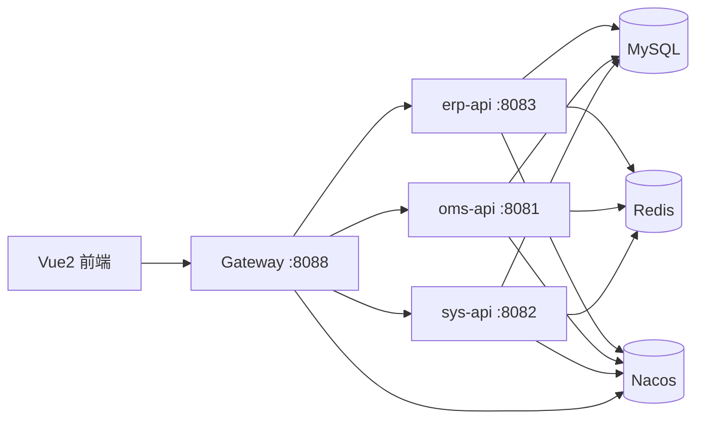
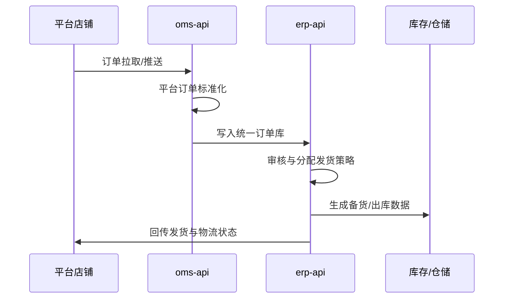
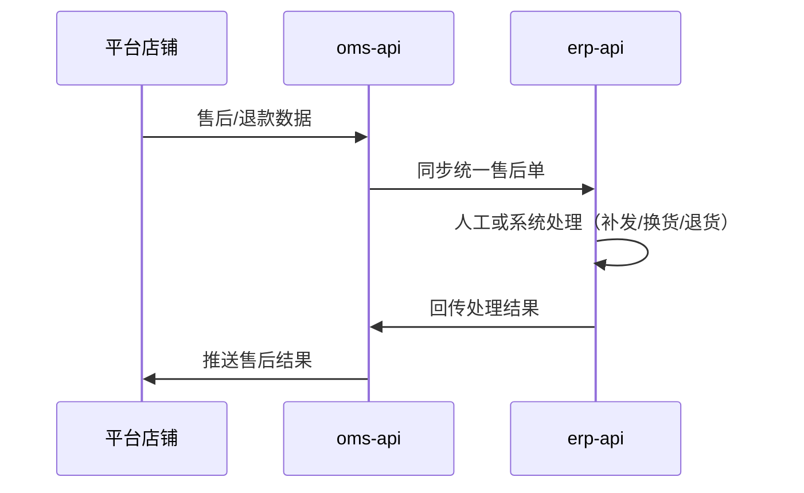

# 启航电商 ERP 开源版深度介绍

## 1. 项目定位与建设目标

启航电商 ERP（`qihang-ecom-erp-open`）定位为电商企业的“订单中台 + 业务中台”底座，面向多平台、多店铺的订单履约场景，重点解决商品、订单、售后、发货、库存与系统管理一体化协同问题。项目官方描述其核心能力包含：多平台订单聚合、售后处理、库存管理与开放接口对接。

从工程结构看，系统采用前后端分离 + 微服务拆分，兼顾“可直接使用”与“二次开发扩展”两种落地模式。

## 2. 技术架构总览

### 2.1 技术栈

- 后端：Spring Boot 3.0.2、Spring Cloud 2022、Spring Cloud Alibaba 2022.0.0.0（Nacos + Sentinel 生态）。
- 安全：Spring Security + JWT + Redis 会话缓存。
- 数据层：MyBatis-Plus + MySQL 8。
- 前端：Vue2 + Element UI。

项目根 `pom.xml` 采用多模块聚合管理，划分为 `api`、`core`、`model`、`mapper`、`service`、`serviceImpl` 等子工程。

### 2.2 微服务与网关拓扑

网关服务 `gateway` 运行在 `8088`，通过 Spring Cloud Gateway 按路径前缀分发到多个后端服务：

- `/api/erp-api/**` → `erp-api`
- `/api/oms-api/**` → `oms-api`
- `/api/open-api/**` → `open-api`（当前仓库聚合中未启用该子模块）
- `/api/sys-api/**` → `sys-api`

`erp-api`、`oms-api`、`sys-api` 分别默认使用 `8083`、`8081`、`8082` 端口，并都注册到 Nacos。

### 2.3 分层模块设计

系统在“服务编排层—公共能力层—领域模型层”有明显分工：

1. `api/*`：对外 HTTP 接口与服务启动入口，按业务边界拆服务。
2. `core/common`：通用结果封装、常量、缓存配置、任务调度、AOP 日志等横切能力。
3. `core/security`：统一登录认证、JWT 校验、权限控制、用户上下文。
4. `model`：实体（Entity）、请求体（Request/BO）、视图对象（VO）与系统模型定义。
5. `service` / `serviceImpl` / `mapper`：业务服务接口、实现及数据库访问层。

这类结构便于后续把平台接入、履约规则、库存策略等能力做成可替换或可独立演进的模块。

## 3. 安全与认证架构

### 3.1 认证流程

系统使用 Spring Security 的无状态模式（`SessionCreationPolicy.STATELESS`）：

1. 用户访问 `POST /login`。
2. `SysLoginService` 做验证码校验、账号密码校验、AuthenticationManager 认证。
3. 认证成功后由 `TokenService` 生成 JWT，并在 Redis 存储登录态（含过期时间）。
4. 后续请求由 `JwtAuthenticationTokenFilter` 解析 Token，恢复 `LoginUser` 到 SecurityContext。

### 3.2 鉴权策略

- `SecurityConfig` 中对白名单接口（登录、验证码、部分查询接口等）放行。
- 业务接口通过 `@PreAuthorize("@ss.hasPermi('xxx')")` 执行细粒度权限判定。
- Token 默认 30 分钟有效，并在临近到期时自动续期（滑动过期体验）。

这一方案的优点是：网关与各服务都可保持无状态部署，结合 Redis 实现可控会话生命周期。

## 4. 业务能力设计（功能域）

### 4.1 总体业务版图

根据 README 和代码目录，当前系统能力可归纳为：

- 商品域：商品主数据、SKU、品牌、分类、店铺商品映射。
- 采购域：采购单、采购入库、采购物流、供应商。
- 订单域：聚合订单库、店铺订单拉取、审核、发货分配。
- 发货域：手工/供应商发货、物流公司、电子面单账户、发货记录。
- 售后域：退款/售后单拉取、处理结果回推。
- 库存域：库存查询、入库、出库、仓库仓位。
- 系统域：用户、角色、菜单、字典、配置、任务调度。

### 4.2 平台接入能力

`oms-api` 下按平台划分目录（`tao/jd/pdd/dou/wei/kwai`），每个平台都具备相对完整的控制器组（OAuth、商品、订单、售后、电子面单等），体现出“统一业务骨架 + 平台适配层”的接入模式。

这意味着新增平台（如小红书）时，可复用既有领域服务与数据结构，仅新增平台协议适配与路由入口。

### 4.3 自动化任务能力

系统内置动态定时任务框架：

- `SchedulingConfiguration` 会扫描 `IPollableService` 实现并动态加载 Cron。
- `CronTaskLoader` 启动后定期刷新任务配置。
- 如 `PddOrderPullTask` 会按任务配置周期自动拉取拼多多店铺订单。

这使“订单/售后自动拉取”具备运行时可调能力，无需每次改代码重启发布。

## 5. 数据架构与模型组织

### 5.1 表设计分域

初始化 SQL 可见明显的“前缀分域”策略：

- `sys_*`：用户、角色、菜单、字典、任务等系统数据。
- `o_*`：统一业务中台核心对象（订单、商品、店铺、库存、售后等）。
- `oms_*`：按平台存储的原始/平台侧业务数据（`oms_tao_*`、`oms_jd_*`、`oms_pdd_*` 等）。
- `erp_*` / `wms_*`：采购、仓储、入出库与仓位相关数据。
- `offline_*`：线下订单与售后数据。

这种“平台原始数据层 + 中台统一模型层”的结构，有利于对接差异化平台字段，并在中台层沉淀统一业务规则。

### 5.2 模型工程特点

`model` 模块内含大量 `entity / bo / vo / request / query`，说明系统在接口输入输出和领域对象间做了职责区分，减少前后端、服务间数据耦合。

## 6. 前端架构与交互设计

前端项目位于 `vue/`，采用典型后台管理系统组织方式：

- `src/api/*`：按业务域和平台拆分 API 调用层。
- `src/views/*`：页面视图，覆盖系统管理、各平台业务、采购、库存、发货、售后等。
- `src/store/*`：用户、权限、字典、标签页等全局状态。
- 动态路由与菜单权限由后端 `getRouters` / `getInfo` 配合实现。

从视图数量看（100+），该项目已不是单一“订单工具”，而是完整中后台套件。

## 7. 工程可扩展性评估

### 7.1 优势

1. **模块边界清晰**：服务层、公共层、模型层分离，便于演进。
2. **平台扩展友好**：`oms-api` 按平台隔离适配逻辑，新增渠道成本相对可控。
3. **调度能力成熟**：动态 cron 刷新机制支持持续运营优化。
4. **权限模型完整**：用户/角色/菜单/按钮权限链路齐全，适配企业后台治理。

### 7.2 可改进方向

1. `api/pom.xml` 中声明了 `open-api` 路由，但当前模块聚合列表未包含，建议统一模块清单与网关路由，避免配置漂移。
2. 部分示例配置中包含明文数据库账号密码，建议改为环境变量/配置中心托管。
3. `serviceImpl` 聚合模块下子模块暂处注释状态，建议补齐说明（历史迁移、重构中或已废弃）。
4. 可以补充统一架构图、调用链路图与领域事件说明，降低新团队接入成本。

## 8. 典型业务链路（设计视角）

### 8.1 订单处理链路

### 8.2 售后处理链路

## 9. 结论

启航电商 ERP 开源版具备“多平台接入 + 中台统一建模 + 微服务治理 + 权限与任务体系”四个核心支点，适合中大型电商团队搭建自有业务中台。对于希望在开源基础上二开的团队，该项目已提供较完备的模块骨架、数据模型与运营任务机制，可作为长期演进的基础工程。
